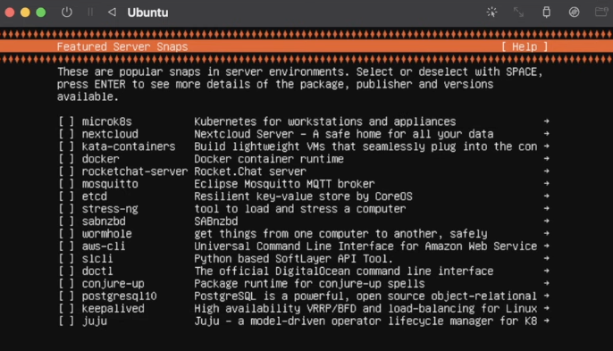
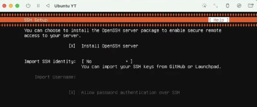

# Práctica 1 - Entornos de desarrollo

Es probable que hayas experimentado la laboriosa tarea de preparar y mantener un entorno de desarrollo para un proyecto. Este proceso puede ser particularmente desafiante, dependiendo de la complejidad del proyecto en cuestión. Además, mantener dicho entorno en un estado óptimo puede ser complicado, especialmente **si se comparte la misma máquina con otros entornos de desarrollo**.

Es común trabajar en proyectos con diferentes versiones de lenguajes de programación, bases de datos y librerías, lo que puede llevar a una gran cantidad de conflictos y problemas al actualizar cualquier componente del sistema. Esta situación a menudo nos lleva a evitar actualizar los componentes del sistema y trabajar en un sistema desactualizado e inseguro, lo que nos impide aprovechar las ventajas de las actualizaciones disponibles.

Afortunadamente, los **contenedores** son una solución para estos problemas. Permiten aislar el entorno de desarrollo del resto del sistema, lo que significa que se pueden tener diferentes versiones de software sin preocuparse por conflictos.

**Docker** es el motor más popular para gestión de contenedores y aunque funciona en diferentes sistemas operativos, está especialmente optimizado para su uso en **Linux** por su estrecha integración a nivel kernel. 

Los contenedores de Docker utilizan las funcionalidades del kernel de Linux llamadas **cgroups** y **namespaces**. Los **cgroups** permiten que los contenedores tengan recursos aislados y asignados, como la CPU, la memoria y el ancho de banda. Por otro lado, los **namespaces** permiten que cada contenedor tenga su propio espacio de nombres para el sistema de archivos, la red y otros recursos del sistema, lo que significa que cada contenedor tiene su propia vista aislada del sistema, sin interferir con otros contenedores o con el sistema operativo que los hostea.

## Instalando Linux - Ubuntu 22.04.2

En primer lugar debemos obtener la imagen de Ubuntu, que puede ser descargada de los siguientes links:

**x86**

[https://ubuntu.com/download/server](https://ubuntu.com/download/server)

**Apple Silicon**

[https://ubuntu.com/download/server/arm](https://ubuntu.com/download/server/arm)

Existen varias alternativas de máquinas virtuales que se pueden utilizar para instalar la imagen y ejecutar Linux en diferentes arquitecturas, incluyendo ARM y x86. A continuación listamos algunas de ellas:

- **VirtualBox**: Es un software de virtualización desarrollado por Oracle que permite ejecutar sistemas operativos en máquinas virtuales. Es compatible con diferentes arquitecturas, incluyendo ARM y x86. [https://www.virtualbox.org/](https://www.virtualbox.org/)
- **UTM**: Es una herramienta de virtualización de código abierto que se enfoca en la emulación de sistemas operativos para arquitecturas diferentes, incluyendo ARM y x86. UTM se puede utilizar en sistemas operativos como macOS, Linux y Windows: [https://mac.getutm.app/](https://mac.getutm.app/)
- QEMU: Es un software de virtualización de código abierto que permite ejecutar sistemas operativos en diferentes arquitecturas, incluyendo ARM y x86. [https://www.qemu.org/](https://www.qemu.org/)
- VMware Workstation: Es un software de virtualización, pago, que permite ejecutar sistemas operativos en máquinas virtuales. Es compatible con diferentes arquitecturas, incluyendo ARM y x86. [https://www.vmware.com/products/workstation-pro.html](https://www.vmware.com/products/workstation-pro.html)
- KVM: Es un hipervisor de virtualización de código abierto que permite ejecutar sistemas operativos en diferentes arquitecturas, incluyendo ARM y x86. KVM está disponible en diferentes distribuciones de Linux, como Ubuntu, Fedora y CentOS. [https://help.ubuntu.com/community/KVM/Installation](https://help.ubuntu.com/community/KVM/Installation)

> 游눠ㅁl momento de realizar la instalación de Linux, instalaremos dos paquetes importantes para el uso habitual que le daremos a este servidor. En primer lugar instalaremos OpenSSH y luego Docker. Para este último debemos ingresar e instalar la versión estable.
> 
> 
> 
> 
> 
> 

Una vez completada la instalación de Linux, accedemos al prompt con nuestro usuario y contraseña, definidos en el proceso de instalación, y procedemos a actualizar todos los paquetes del sistema mediante el siguiente comando:

```powershell
sudo apt-get update
```

Además de actualizar los paquetes de Linux, ejecutar este comando también nos permitirá verificar que nuestra máquina virtual está conectada a la red.

## Docker 🐳

Docker es una plataforma que permite crear y ejecutar aplicaciones en contenedores aislados, lo que facilita su despliegue y asegura que funcionen en diferentes sistemas, es decir, mayor portabilidad.

Para comprobar si Docker está instalado en nuestra máquina virtual, podemos utilizar el siguiente comando:

```powershell
docker
```

Mostrará  los comandos disponibles. Luego, para verificar la instalación, podemos ejecutar el comando:

```powershell
sudo docker run hello-world
```

Ejecutará un contenedor con la imagen "hello-world" y mostrará un mensaje de éxito en la consola.

### Comandos Relevantes

- `docker run ubuntu echo 'Hello, world!'`
    
    Se utiliza para crear y ejecutar un contenedor a partir de la imagen `ubuntu` y ejecutará el comando `echo 'Hello, world'` dentro del contenedor.
    
- `docker stop container-name`
    
    Este comando se utiliza para detener un contenedor que está en ejecución cuyo ID es `container-name`. 
    
- `docker ps`
    
    Se utiliza para listar los contenedores que están en ejecución en el sistema.
    
- `docker images`
    
    Este comando se utiliza para listar las imágenes de Docker que están almacenadas en el sistema.
    
- `docker build -t image-name .`
    
    Este comando se utiliza para crear una nueva imagen con nombre `image-name` a partir de un archivo Dockerfile ubicado en el directorio `.`.

- `docker logs -f <container-id>`

    Muestra los logs de consola generados por un container.
