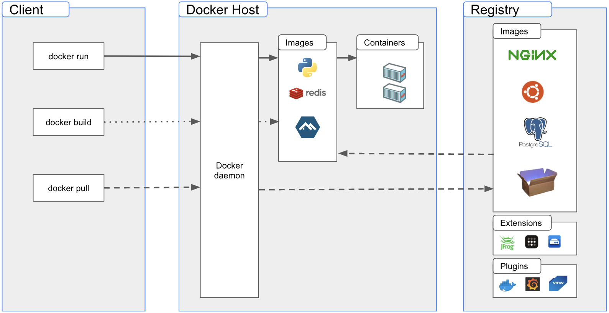

# Arquitectura de Microservicios

## Máquinas Virtuales vs Hipervisores vs Contenedores

El objetivo de los contenedores, las máquinas virtuales y los hipervisores es compartido. Son tecnologías que se utilizan para crear entornos virtualizados, ejecutar aplicaciones y/o sistemas operativos de manera eficiente y segura. 

> 💡 Que el **objetivo** sea el mismo no quiere decir que sean herramientas similares. al igual que un bisturí y un cuchillo de pan, su fin es cortar, pero el **contexto de uso** define su elección.
> 

En términos simples, **una máquina virtual** es como una computadora simulada dentro de una computadora real (inception). Esta máquina virtual ejecuta un sistema operativo completo en un entorno virtualizado, lo que significa que comparte los recursos físicos de la computadora real que le fueron asignados, pero se ejecuta como si fuera una computadora independiente.

Por otro lado, un **hipervisor** es una capa de software que se utiliza para crear y gestionar máquinas virtuales. El hipervisor se encarga de asignar recursos físicos a las máquinas virtuales y de gestionar la comunicación entre ellas tanto como los dispositivos de hardware disponibles. 

Los hipervisores se clasifican en dos tipos:

- Bare-metal: Se ejecutan directamente en la máquina física, sin necesidad de un sistema operativo host. Este tipo de hipervisor es más eficiente porque tiene acceso directo al hardware.
- Hosted: Se ejecutan como una aplicación en un sistema operativo anfitrión. Este tipo de hipervisor es menos eficiente porque tiene que pasar por el sistema operativo host para acceder al hardware físico.

En cuanto a los **contenedores**, podrían ser pensados como máquinas virtuales pero con la diferencia de que **comparte el mismo kernel** con el sistema operativo host y sus recursos, lo que los hace más livianos y rápidos. Además, los contenedores utilizan imágenes que contienen todo lo necesario para ejecutar una aplicación, lo que aumenta la **portabilidad y escalabilidad.** Los contenedores se ejecutan aislados del sistema operativo host y de otros contenedores.

## Docker 🐳

Docker nos permite tomar el control total (crear, eliminar, pausar y arrancar) de los contenedores, para ello vamos a entender un poco más su arquitectura. Docker es una app construida con una arquitectura cliente-servidor y fue escrita en GO. Consta de tres módulos principales:



1. Client: Es la aplicación que se utiliza habitualmente para ejecutar comandos como los vistos anteriormente. Se comunica directamente con el **daemon**, que está dentro del host mediante una API. **** 
2. Host: Refiere a la máquina física o virtual en la que se ejecuta el motor de Docker y se alojan las imágenes descargadas y los contenedores. El **daemon** es el componente principal del sistema, que se ejecuta en segundo plano, y es responsable de la creación y administración de contenedores.
3. Registry: Es un servidor centralizado para el almacenamiento y distribución de imágenes, que se integra con el **daemon** y **** permite a los usuarios buscar y descargar imágenes directamente desde el registro. Además ofrece funciones de seguridad para controlar el acceso a las imágenes

### Images

Una imagen de Docker **es una plantilla de solo lectura que define su contenedor**. La imagen contiene el código que se ejecutará, incluida cualquier definición para cualquier biblioteca o dependencia que el código necesite. Un contenedor de Docker es una imagen de Docker instanciada (en ejecución).

### Volumes

Los volúmenes son una forma de almacenar y compartir datos de un contenedor, son directorios o archivos almacenados en el host, y se mantienen independizados del filesystem del contenedor. Esto significa que, incluso si se elimina o actualiza el contenedor, los datos del volumen permanecerán intactos. Además pueden ser compartidos entre múltiples contenedores.

### Containers

Un contenedor es el resultado de la ejecución de una imagen. Envuelve el software de una aplicación y contiene todo lo que necesita para ejecutarse, incluyendo en algunos casos el sistema operativo, el código de la aplicación, las bibliotecas, etc. También si fuera necesario se crea una interfaz de red para que el contenedor pueda comunicarse con el host local, asigna una dirección IP disponible al contenedor y por último, ejecuta el proceso que fue especificado en el Dockefile. Para permitir que el contenedor escriba datos en tiempo de ejecución, Docker agrega un sistema de archivos de escritura sobre el filesystem de solo lectura de la imagen.

## Luz, cámara & acción 🎬

Vamos a comenzar iniciando una instancia de PSQL, pero conectándonos a través de SSH, para ello vamos a setear el network en tipo **Emulated VLAN (UTM)** y luego agregando un port forwarding desde el 22 → 2222 vamos a poder acceder a ella. Dependiendo de la maquina virtual en uso la forma de configuración puede variar.

Para consultar nuestro ip podemos ejecutar en la consola de linux `ip addr`


y luego para conectarnos desde nuestra máquina host ejecutaremos:

```docker
ssh -p 2222 linux-user@localhost
```

Ahora vamos a iniciar un contenedor PSQL e investigar un poco más acerca de que sucede:

```docker
docker run --name ams -e POSTGRES_PASSWORD=password -d postgres:14.1-alpine

#Verificamos que la imagen se descargó (si es que aún no lo estaba)
docker images

#Verificamos que efectivamente el contenedor está corriendo
docker ps
```

Dado que tenemos una base de datos activa y corriendo, lo más probable es que intentemos agregar información en ella. Para ello deberíamos acceder a la terminal de PSQL y poder ejecutar SQL queries. Una forma sencilla de hacer eso, es ejecutando en docker un `exec` 

```docker
docker exec -ti ams psql -U postgres

#Esto nos habilita una consola de postgres
postgres=# CREATE TABLE test(col_a VARCHAR,col_b VARCHAR,PRIMARY KEY(col_a));
```

Aunque resulta conveniente para operaciones simples, si en el futuro necesitamos realizar consultas más complejas, esto podría complicarse. Por esta razón, nos gustaría tener acceso desde un cliente como PGAdmin o DataGrip. Para lograrlo, realizaremos un port forwarding desde la máquina virtual para exponer el puerto 5432, que es el predeterminado para cualquier base de datos PostgreSQL. Una vez realizado el forwarding intentaremos conectarnos desde nuestro cliente:


### ¿Qué pasó? ⚠️

Si el contenedor no está corriendo podremos iniciarlo con el comando `docker start ams`
Aún así no logramos acceder a la base de datos expuesta en el contenedor, y esto es debido a que no se configuró en el comando inicial el **port binding.** Esto quiere decir que la base de datos expone solo su puerto para el contenedor en el que se encuentra. Para solucionarlo tenemos dos alternativas posibles:

1. Realizar un [commit](https://docs.docker.com/engine/reference/commandline/commit/) sobre la imagen existente y volver a correrla.
2. Eliminar el contenedor existente y volver a realizar el comando run. ✅

Optaremos por el camino 2. dado que recién comenzamos con la configuración del contenedor y es más simple.

```docker
docker stop ams
docker rm ams
docker run --name ams -p 5432:5432 -e POSTGRES_PASSWORD=password -d postgres:14.1-alpine
```

Estamos en condiciones ahora de volver a intentar probar con el cliente.


Intentemos realizar una query sobre la tabla **test** creada anteriormente:

```docker
SELECT * FROM test;
[42P01] ERROR: relation "test" does not exist
```

Recordemos que los contenedores escriben sobre la capa superior, que es la única de escritura, entonces al eliminar el contenedor, dicha capa dejó de existir, y todos los datos que podríamos haber tenido en ella no están más. Para resolver esto debemos crear un volumen que persista más allá del ciclo de vida del contenedor.

```docker
docker volume create ams-vol

#Detenemos el contenedor y lo eliminamos como hicimos anteriormente.

docker run --name ams -v ams-vol -p 5432:5432 -e POSTGRES_PASSWORD=password -d postgres:14.1-alpine

#Debemos volver a crear la tabla como hicimos anteriormente o podrán hacerlo desde el cliente.
```

Entonces si ahora eliminamos el contenedor nuevamente, la base de datos debería persistir, intentémoslo.

### ¿Qué pasó? ⚠️

El contenedor conoce que existe un volumen asociado a él, pero Postgres no. Postgres guarda su información en algún lugar del filesystem del contenedor, entonces debemos mapear el path dónde la información se encuentre ubicada para poder guardarla al volumen creado. Para hacerlo veamos el filesystem del contenedor

```docker
docker exec -ti ams /bin/bash
```


Podemos ver que el volumen **************ams-vol************** esta correctamente montado. Según [la documentación de Postgres](https://www.postgresql.org/) vemos que la información se guarda en `/var/lib/postgresql/data` y es eso lo que debemos mapear.

```docker
docker run --name ams -v ams-vol:/var/lib/postgresql/data \
					 -p 5432:5432 \
           -e POSTGRES_PASSWORD=password \
           -d postgres:14.1-alpine
```

Esto quiere decir que en el volumen ************ams-vol************ estaremos guardando todo el filesystem que se encuentre debajo de `/var/lib/postgresql/data` un éxito 🍾

Volver a crear la tabla test, finalizar el contenedor de portgres y volver a inicializarlo. Conformar que la tabla sigue creada. 

Ahora pueden instalar el cliente de postgres en el ubuntu:

```bash
sudo apt-get install -y postgresql-client
```

Desde ubuntu conectarse al postgres y confirmar que la tabla test creada anteriormente sigue estando ahí.

Parar el contenedor de la base de datos y ejecutarlo de nuevo com:

```bash
docker run --name ams -v ams-vol:/var/lib/postgresql/data \
						-p 5432:5432 \
						-e POSTGRES_PASSWORD=password \
						--network internal \
						-d postgres:14.1-alpine
```

Vamos a crear además otro contenedor con un portgres manager y dos interfaces, una mistando hacia externa (pública) y otra interna y compartida con la base de datos. 

```bash
docker run -d --rm \
		-e PGADMIN_DEFAULT_EMAIL=user@itba.edu \
		-e PGADMIN_DEFAULT_PASSWORD=p4ssw0rd \
		-v $PWD/admin_vol:/var/lib/pgadmin \
		--name pgadm \
		-p 5050:8088 \
		--network default \
		dpage/pgadmin4
```

Conectándose al puerto 8088 con el navegador de su PC (no desde el ubuntu) pueden acceder a la consola Web del PGAdmin [http://localhost:8088](http://localhost:8088) .

- ¿Pueden conectarse en forma directa a la base de datos? ¿Por qué?
- ¿Pueden salir desde la base de datos a Internet?
- ¿Como es la tabla de ruteo de la base de datos?

## Netflix + Microservicios 🔎

Les dejo una interesante charla que Josh Evans dio y cuenta como Netflix, encontró monolitos no tan aparentes dentro de sus estructuras de comunicación y servicios y cómo los fueron diversificando hasta lograr masterizar los microservicios: 

[https://www.youtube.com/watch?v=CZ3wIuvmHeM&ab_channel=InfoQ](https://www.youtube.com/watch?v=CZ3wIuvmHeM&ab_channel=InfoQ)