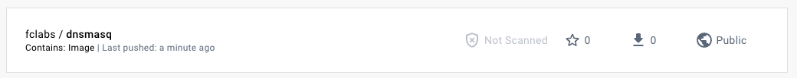
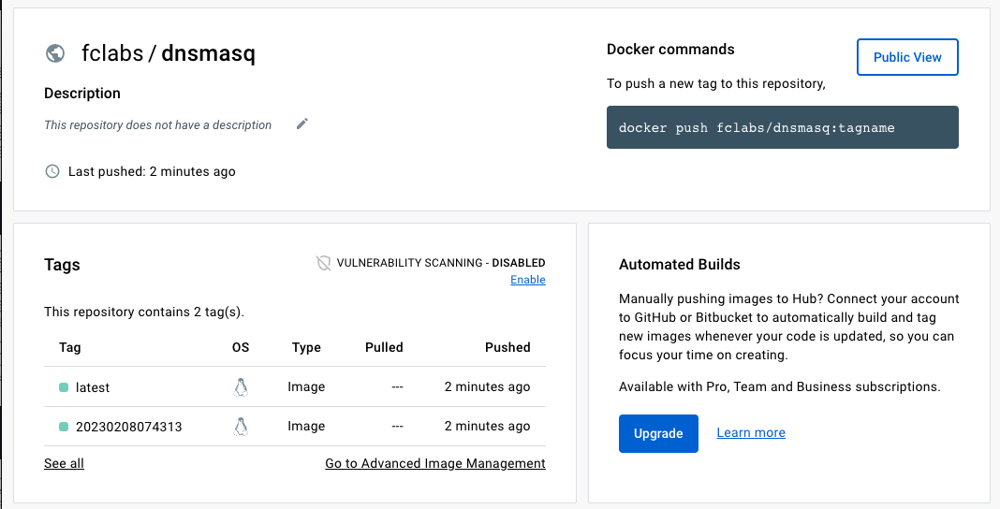

# Contrucción de una imagen de contenedor

## Crear la image

Parado dentro del directorio ejercutar:

```bash
export IMAGE_TAG=$(date "+%Y%m%d%H%M%S")
docker build -t "dnsmasq:${IMAGE_TAG}" .
```

Esto construira una imagen con el nombre dnsmasq y el tag con la fecha en unix time.

## Definirla como la última

Para definirla como la última imagen válida, vamos a crear una tag adicional.

```bash
docker image tag "dnsmasq:${IMAGE_TAG}" "dnsmask:latest"
```
## Viendo las imágenes creadas

Corriendo un `docker image ls` podemos ver las imágenes locales.

```
REPOSITORY            TAG              IMAGE ID       CREATED         SIZE
dnsmasq               20230208074313   a1a1475c3d6f   23 hours ago    7.27MB
dnsmasq               latest           a1a1475c3d6f   23 hours ago    7.27MB
```

## Subiendo la image a la registry

Para poder subir una imagen a la registry primero crear una cuenta en el proveedor. Usaremos [DockerHub](https://hub.docker.com/).

Con el usuario y password loguearse en docker con `docker login -u username`


```
Login Succeeded

Logging in with your password grants your terminal complete access to your account. 
For better security, log in with a limited-privilege personal access token. Learn more at https://docs.docker.com/go/access-tokens/
```

Una vez que se loguearon exitosamente en la registry, se debe crear un tag que incluya la registry y el usuario. El formato para DockerHub es `docker.io/<username>`

```bash
docker image tag "dnsmasq:${IMAGE_TAG}" "docker.io/fclabs/dnsmasq:latest"
docker image tag "dnsmasq:${IMAGE_TAG}" "docker.io/fclabs/dnsmasq:${IMAGE_TAG}"
```

Y entonces pasamos a tener:

```
REPOSITORY                               TAG              IMAGE ID       CREATED         SIZE
fclabs/dnsmasq                           20230208074313   a1a1475c3d6f   23 hours ago    7.27MB
fclabs/dnsmasq                           latest           a1a1475c3d6f   23 hours ago    7.27MB
dnsmasq                                  20230208074313   a1a1475c3d6f   23 hours ago    7.27MB
dnsmasq                                  latest           a1a1475c3d6f   23 hours ago    7.27MB
```

**NOTA: No se ve el docker.io porque docker lo asume como default, y no lo imprime.**

Con eso entonces ya podemos hacer un push y subir las imágenes con `docker push docker.io/fclabs/dnsmasq:latest`.

```
The push refers to repository [docker.io/fclabs/dnsmask]
ea5080ac1340: Pushed 
3e145acb111a: Pushed 
eed8ef59b47f: Pushed 
bf19e9e7a42f: Pushed 
1ecc925d1390: Pushed 
```

Y lo mismo para la imagen con la fecha `docker push docker.io/fclabs/dnsmasq:${IMAGE_TAG}`

```
The push refers to repository [docker.io/fclabs/dnsmasq]
ea5080ac1340: Layer already exists 
3e145acb111a: Layer already exists 
eed8ef59b47f: Layer already exists 
bf19e9e7a42f: Layer already exists 
1ecc925d1390: Layer already exists 
20230208074313: digest: sha256:b6fd429dbddb8f68150030537e6ab293c67dfd0747d614269cd60c17b41ab8e7 size: 1360
```

Yendo a DockerHub, van a poder ver en su cuenta la image.



Y entrando en la image, el detalle de la imagen y sus tags.

